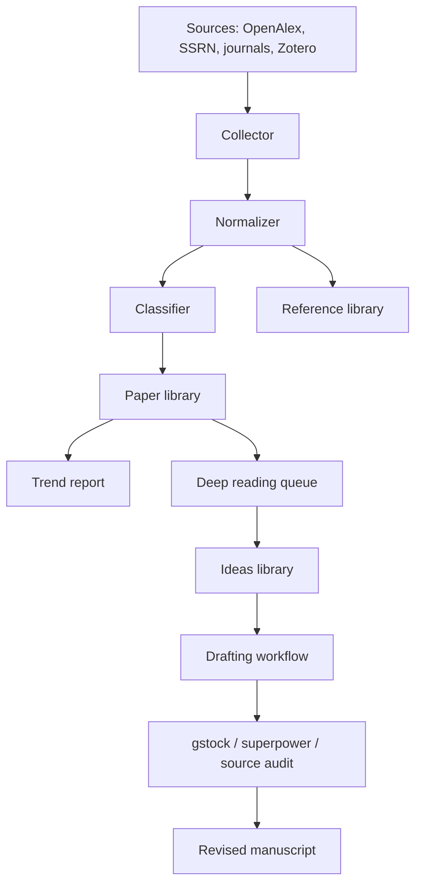

# Agent Architecture

## Core idea

The system has three loops:

1. Collection loop: search recent accounting research, normalize metadata, classify papers, and merge them into the old library.
2. Reading loop: turn selected papers into structured notes and save your ideas.
3. Writing loop: use research/write/review/revise/finalize tools to draft, then run independent hallucination checks.

## Data flow

## Suggested agents

### Literature scout

Finds new papers, keeps source URLs and identifiers, and avoids duplicates.

### Classifier

Assigns accounting subfields using keyword rules first, then an LLM if available.

### Extractor

Summarizes research question, method, data, main findings, identification strategy, and limitations.

### Citation collector

Collects referenced papers from OpenAlex `referenced_works`, DOI links, BibTeX, or full-text references.

### Trend analyst

Aggregates new papers by field, method, data source, and theme.

### Idea librarian

Stores your reading notes, sparks, possible hypotheses, required data, and target journals.

### Writing supervisor

Runs draft generation, then sends output to independent checkers for source grounding and hallucination detection.

